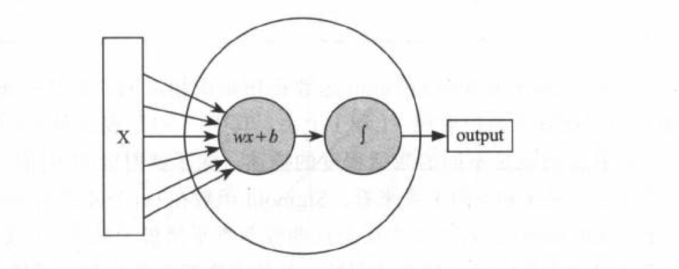
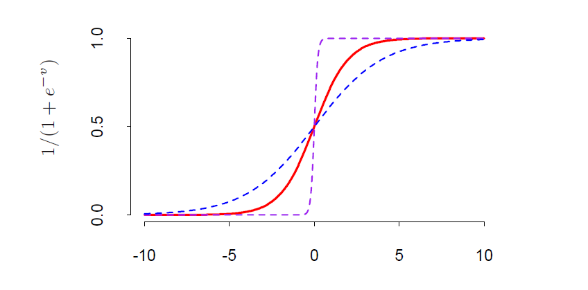
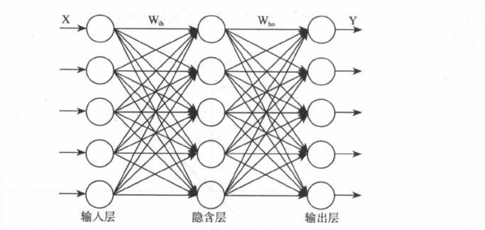
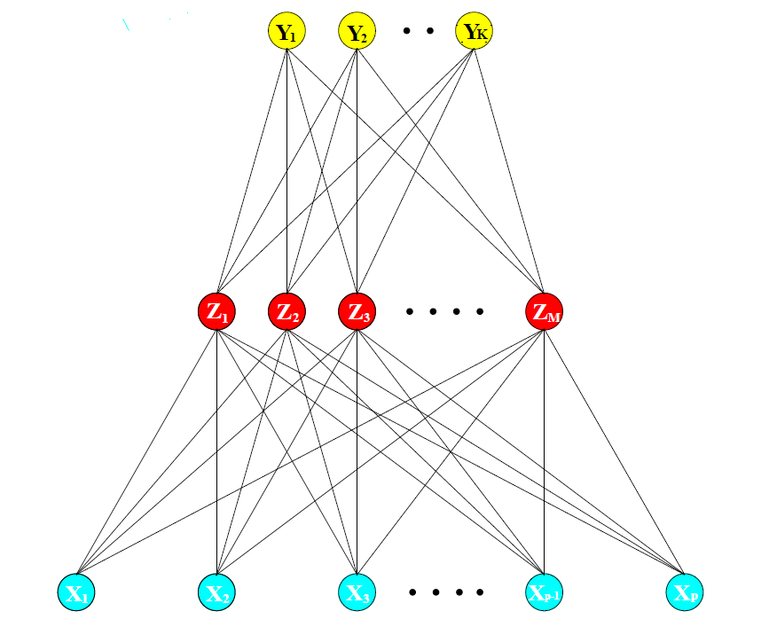

# 神经网络 {#nn}

## 研究背景(解决的问题、应用场景、发展过程)

## 内容

### 神经元

神经元是神经网络基本构成单元，它主要由线性模型和激活函数两部分构成。如下图所示：




常用的激活函数：

- Sigmoid 函数

\begin{equation} 
  f(x) = \frac{1}{1+e^{-(wx+b)}}
  (\#eq:sigmoid)
\end{equation}

  
      
- Tanh 函数

      $$f(x) = \frac{e^{x}-e^{-x}}{e^{x}+e^{-x}}$$
      
- ReLU 函数

     $$f(x) = max(0 , x)$$
     

     
如上图，神经元就是通过通过这种首尾相连的方式进行信息传递，前一个神经元接受数据，经过处理传递给下一层的一个或者多个神经元。一旦多个神经元首尾连接形成一个类似网络的结构来协同工作的时候，那就可以被称为神经网络了。

### 神经网络

神经网络主要的思想:提取输入特征变量的线性组合作为衍生特征，然后对这些衍生特征进行非线性建模。单层感知机（单隐层反向传播网络）如下图:



数学表达式为:

\begin{align} 
Z_m &= \sigma(\alpha_{0m} + \alpha_m^T X) , m = 1 , \dots , M,\\
T_k &= \beta_{0k}+ \beta_k^{T}Z , k = 1, \dots , K,\\
f_k(X) &= g_k(T) , k = 1, \dots , K,
\end{align} 

通常隐藏层的激活函数$\sigma(\cdot)$ 选择 Sigmoid  函数\@ref(eq:sigmoid),有时也选择高斯径向基函数,当然选择高斯径向基函数时得到的模型被称为径向基传播神经网络.对于回归模型,输出层的激活函数选择恒等函数,即$g_k(T) = T_k$,对于分类模型,输出层的激活函数选择 SoftMax 函数,即

$$g_k(T) = \frac{e^{T_k}}{\sum_{k =1}^{K}e^{T_k}}$$

```{block2, note-text, type='rmdtip'}
神经网络输出为n个类别的向量$[1 , 0 , 0 ,  \cdots , 0]$,如何度量向量与期望向量之间的距离,通过交叉熵来判定，而交叉熵度量的是两个概率分布之间的距离，因此需要将输出结果转化成概率,经过softmax回归函数转化之后的输出表示一个样例为不同类别的概率有多大.

```

现在我们已经建立起模型了，但是模型中存在未知参数需要通过训练数据来进行学习。学习参数的过程即为拟合模型过程,神经网络模型的效果以及优化的目标是通过损失函数来反应.


- 分类

      - 交叉熵: 度量两个概率分布之间的距离.
            $$R(\theta) = - \sum_{i = 1}^{N} \sum_{k =1}^{K} y_{ik}logf_k(x_i)$$
            
- 回归

      - 均方误差
      $$R(\theta) = \sum_{k =1}^{K} \sum_{i = 1}^{N} (y_{ik} - f_k(x_i))^2$$
      
      
如何得到使损失函数达到最小的模型参数?
 
   - 迭代法
   
   迭代法的核心思路就是用步步逼近的方式来接近理论上的精确值,只要发现当前的试探值已经收敛到一个满足场景要求的误差精度就可以判断迭代结束,用这个试探值来充当求解的目标值.
   
   - 梯度下降法

\begin{align}
\nabla &= (\frac{\partial R}{\partial \beta_1} , \dots , \frac{\partial R}{\partial \beta_K}) \\
\beta_n^k  &=  \beta_{n-1}^k - \eta \frac{\partial R}{\partial \beta^k}
\end{align}

### 训练过程存在的问题

- 参数初始化

      - 以0为均值,很小的值为标准差的正态随机数;
      
      - 以0 为均值μ 、以1 为方差σ 的分布生成后除以当前层的神经元个数的算术平方根;
      
    输入特征的权重相当于是一种重视程度或者采纳程度的表示,而在一个模型中那些对判断结果需要作为非常重要的正面因素采纳的是少数，需要作为非常重要的负面因素采纳的也是少数，而其他大部分输入的信息可能就是那些比较中庸的,不论一个单体数据的分布特点如何，在大量单体数据叠加后的宏观数据表现都会呈现出高斯分布的特点,中心极限定理反应的实质.
      

- 学习率

    如果过大的话,参数在极优值的两侧来回移动,不满足收敛性,若过小的话,计算成本较高.指数衰减法,先以快速收敛,后在收敛点稳定下来.

- 层数和每层单元数

    每层单元数 50 ~ 100
    
    
- 梯度消失、梯度爆破

这种问题的发生会让训练很难进行下去,看到的现象就是训练不再收敛一 Loss 过早地不再下降，
而精确度也过早地不再提高.

```{r , echo=FALSE , eval=FALSE}
library(ggplot2)

gene_softmax <- function(x_vectot){
  res <- rep(0 , length(x_vectot))
  for(i in 1:length(x_vectot)){
    res[i] = 1/(1 + exp(-x_vectot[i]))
  }
  return(res)
}
  
#准备数据  
x <- seq(-8, 8, by=1)
y <- gene_softmax(x)
data <- data.frame(x ,y)

p <- ggplot(data, aes(x=x, y=y)) + 
  geom_line(size = 1, colour = "blue") + scale_x_continuous(breaks=seq(-8, 8, 2)) 
p 
```

- 优化到什么程度就可以？防止过拟合。过拟合解决方法 —— 正则化

## 实例分析

