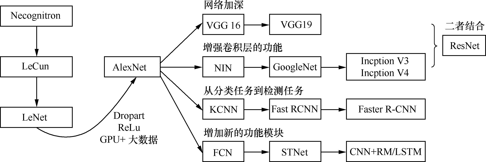
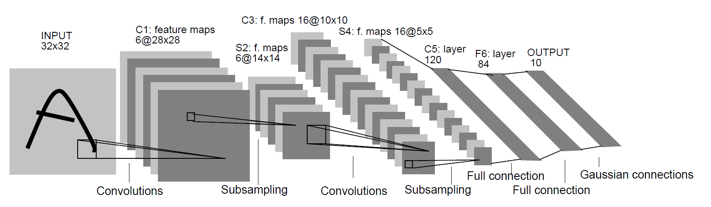
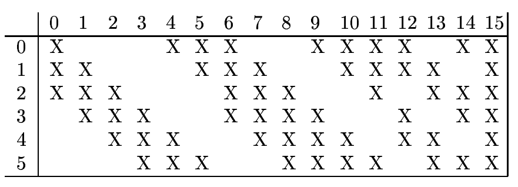
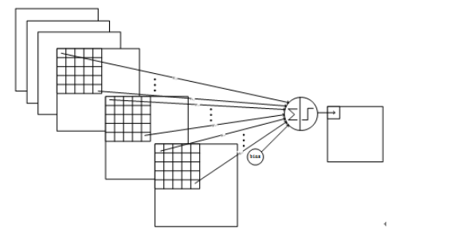
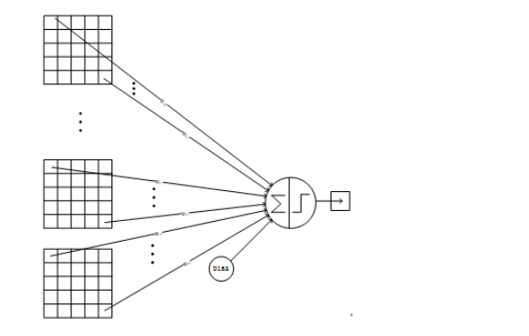
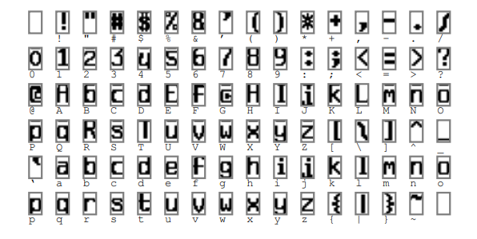
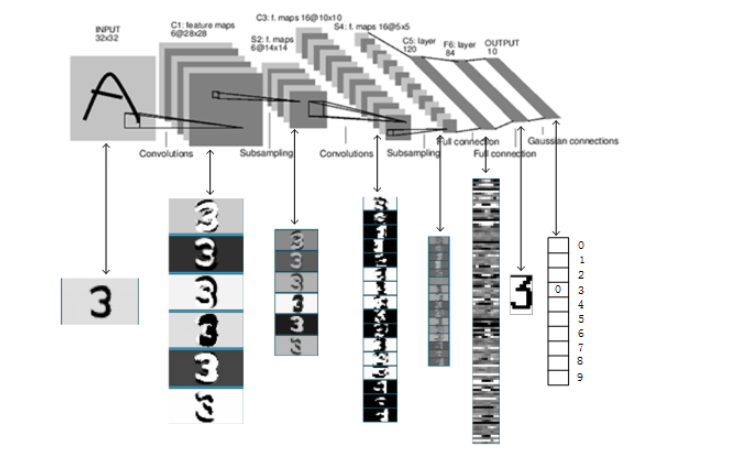

# 卷积神经网络 {#cnn}

## 研究背景以及发展历史


20 世纪60 年代,美国神经生物学家 Hubel 和 Wiesel 在研究猫脑皮层中用于局部敏感和方向选择的神经元时发现其独特的网络结构可以有效地降低反馈神经网络的复杂性,日本人福岛邦彦（ Kunihiko Fukushima）在 20 个世纪 90 年代提出的感知机是卷积神经网络的第一个实现网络.随后,更多的科研工作者对该网络进行了改进.

```{r,'cnn-hist' , fig.align='center', fig.cap='卷积神经网络结构演化的历史' , echo=FALSE ,  fig.width=100 , fig.height=30}

```


## 所要解决的问题

参数数量太多, 收敛速度慢,对于动辄处理百万维度的图像分类任务,由于找不到计算速度能够满足需要的处理器,因此这样的需求变得不可行.
   
## 卷积神经网络如何解决这些问题?

- 局部连接
    
- 权值共享
    
- 下采样

```{block2 , type = 'rmdnote'}
在卷积核对前面输入的这一层数据向量进行扫描的时候,需要对周围进行填充(Padding),主要有两个原因:
  
  1 保持边界信息.因为如果不加Padding的话,最边缘的像素点信息其实仅仅被卷积核扫描了一遍，而图像中间的像素点信息会被扫描多遍,在一定程度上等于降低了边界上信息的参考程度.Padding后就可以在一定程度上解决这个问题.在实际处理的过程中肯定是Padding了一些0值以后,再从Padding后的新边界开始扫描.

  2 保持边界信息.因为如果不加Padding的话,最边缘的像素点信息其实仅仅被卷积核扫描了一遍,而图像中间的像素点信息会被扫描多遍，在一定程度上等于降低了边界上信息的参考程度.Padding后就可以在一定程度上解决这个问题.在实际处理的过程中肯定是Padding 了一些0 值以后,再从Padding 后的新边界开始扫描.
```


卷积神经网络构建由输入层、卷积层、池化层、全连接层和Softmax层组成,具体地可参考[资料](https://blog.csdn.net/yunpiao123456/article/details/52437794).

### LeNet-5 

**LeNet-5** 模型是 Yann LeCun 教授于 1998 年 在论文 [Gradient-BasedLearning Applied to Document Recognition](http://yann.lecun.com/exdb/publis/pdf/lecun-98.pdf)^[Lecun Y, Bottou L, Bengio Y, et al. Gradient-based learning applied to document recognition[J]. Proceedings of the IEEE, 1998, 86(11):2278-2324.] 中提出来的.


```{r,fig.align='center', fig.cap='LeNet5 模型结构图' , echo=FALSE ,  fig.width=100 , fig.height=30}

```


- 输入层

&#160;&#160;&#160;&#160;$32 \times 32$ 灰度值图像

- $C_1$ 卷积层

&#160;&#160;&#160;&#160;对输入图像进行卷积运算(使用 $6$ 个大小为 $5 \times 5$ 的卷积核), 得到 $6$ 个 $C_1$ 特征图( $6$ 个大小为 $28 \times 28$ 的 Feature Maps , $32-5+1=28$ ).总共就有 $6 \times (5 \times 5 + 1)=156$ 个参数,对于卷积层 $C_1$ 总共有 $156 \times 28 \times 28=122304$ 个连接.

- $S_2$ 池化层

&#160;&#160;&#160;&#160;使用 $2 \times 2$ 过滤器进行池化,长和宽池化的步长为 $2$, $2 \times 2$ 单元里的值相加然后再乘以训练参数 $w$, 再加上一个偏置参数 $b$ (每一个 feature map 共享相同 $w$ 和 $b$ ), 然后取 **sigmoid** 值, 作为对应的该单元的值.

- $C_3$ 卷积层

&#160;&#160;&#160;&#160;使用 $16$ 个大小为 $5 \times 5$ 的卷积核进行卷积运算, 因此具有 $16$ 个 Feature Maps, 每个 Feature Maps 的大小为 $(14-5+1) \times (14-5+1) = 10 \times 10$. 每个 Feature Maps 只与上一层 $S_2$ 中部分 Feature Maps 相连接, 下图 \@ref(fig:c3) 给出了 $16$ 个 Feature Maps 与上一层 $S_2$ 的连接方式(行为 $S_2$ 层 Feature Maps 的标号, 列为$C_3$ 层 Feature Maps 的标号,第一列表示 $C_3$ 层的第 $0$ 个 Feature Maps 只有 $S_2$ 层的第$0、1$和 $2$ 这三个 Feature Maps 相连接, 其它类似). 采用部分连接, 主要原因有:

&#160;&#160;&#160;&#160;1 减少参数;
    
&#160;&#160;&#160;&#160;2 打破对称性，这样就能得到输入的不同特征集合.

```{r, 'c3' ,fig.align='center', echo=FALSE ,fig.cap='卷积层3的连接方式'}

```


以第 $0$ 个 Feature Maps 描述计算过程: 用$1$个卷积核(对应 $3$ 个卷积模板,但仍称为一个卷积核,可以认为是三维卷积核)分别与 $S_2$ 层的 $3$ 个 Feature Maps 进行卷积, 然后将卷积的结果相加,再加上一个偏置，再取 **sigmoid** 就可以得出对应的 Feature Maps 了。所需要的参数数目为$$(5 \times 5 \times 3 + 1) \times 6+(5 \times 5 \times 4 + 1 ) \times 9 +5 \times 5 \times 6 + 1 = 1516$$ 
$5 \times5$ 为卷积参数,卷积核分别有 $3 、4、 6$ 个卷积模板, 连接数为$1516 \times 10 \times 10= 151600$ .

$C_3$ 与 $S_2$ 中前 $3$ 个图相连的卷积结构如下图 \@ref(fig:c31) 所示:

```{r, 'c31' ,fig.align='center', echo=FALSE ,fig.cap='C3与S2中前3个图相连的卷积结构图'}

```

- $S_4$ 池化层

过程和 $S_2$类似.

- $C_5$ 卷积层

&#160;&#160;&#160;&#160;使用 $16$ 个大小为 $5 \times 5$ 的卷积核进行卷积运算, 由于 $S_5$ 的图像和卷积核的大小一样, 因此进行的是全连接. 生成 $120$ 个元素的向量,每一个向量的生成过程如下:

```{r, 'c51' ,fig.align='center', echo=FALSE ,fig.cap='C5与S4卷积结构图'}

```

- $F_6$ 全连接层

&#160;&#160;&#160;&#160;计算方式:输入向量与权重向量进行点积运算, 在加上一个偏置项,最后通过 **sigmoid** 函数进行映射.

&#160;&#160;&#160;&#160;说明: $F_6$ 层有 $84$ 个节点, 对应于一个 $7 \times 12$ 的比特图, 这样每个符号的比特图的黑白色就对应于一个编码.

```{r , 'bite' , fig.align='center' , echo=FALSE, fig.cap='比特图'}

```

- $F_7$ 输出层

输出层共有 $10$ 个节点, 分别代表着数字$0 ~ 9$,且如果节点 $i$ 的值为 $0$,则网络识别的结果是数字$i$.
采用的是径向基函数 $(RBF)$ 的网络连接方式.则 **RBF** 输出的计算方式是:

$$y_i = \sum_j (x_j - w_{ij})^2$$


下图 \@ref(fig:t3) 是 **LeNet-5** 识别数字 $3$ 的过程.

```{r , 't3' , fig.align='center' , echo=FALSE, fig.cap='LeNet-5识别数字3的过程'}

```


参考资料

<http://www.cnblogs.com/ooon/p/5415888.html>

<https://blog.csdn.net/happyer88/article/details/46762919>

<https://blog.csdn.net/zhongkeli/article/details/51854619>

<http://cuijiahua.com/blog/2018/01/dl_3.html>
